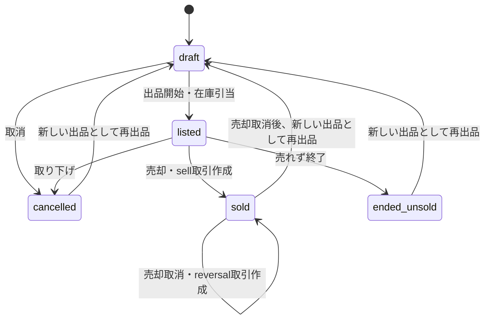

# 出品・売却の状態遷移

`draft` は在庫を引き当てない。`listed` の数量だけをロットの取引残数から差し引いて利用可能数を計算する。出品開始と出品中の数量変更は口座とロットをロックし、最新の利用可能数を確認する。売却確定では同じ DB トランザクション内で `sold` へ移し、対象ロットごとに `sell / out` 取引を作る。売却取消時も同じトランザクション内で全 `sell` 取引を反転し、`sale_reversed_at` を設定する。売却済みの出品履歴は削除しない。

出品先や受け渡し方法は `listed` 中に変更できない。価格変更は履歴を追加する。複数期限のセットや「今売る／セット販売」以外の方針は出品開始時に確認する。譲渡不可ロットは出品開始できない。
