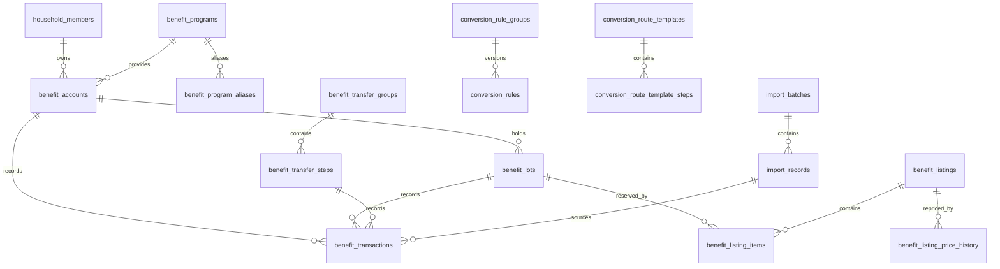

# DB概要

DB仕様の正本は [Issue #2](https://github.com/shikodecom/benefit-treasury/issues/2)。この文書は実装した主要な関連を示す。

残高とロット残数の正本は `benefit_transactions` で、`in` を加算、`out` を減算する。出品予約は `status = listed` の `benefit_listing_items` から算出する。ロットの利用可能数量は残数から出品予約数を引いた値とする。

取引数量、出品数量、移行元数量、交換元数量の正数制約はMySQLのCHECKで保証する。`benefit_transactions` の `(lot_id, account_id)` はロットの口座と一致する複合外部キーを持つ。履歴を保持するため、台帳取引の取消は元行を削除せず、逆方向のreversal取引を追加する。

個人情報や認証情報はseedしない。`import_records.raw_data_json` と `normalized_data_json` は、後続のImporterでサニタイズしてから保存する。
