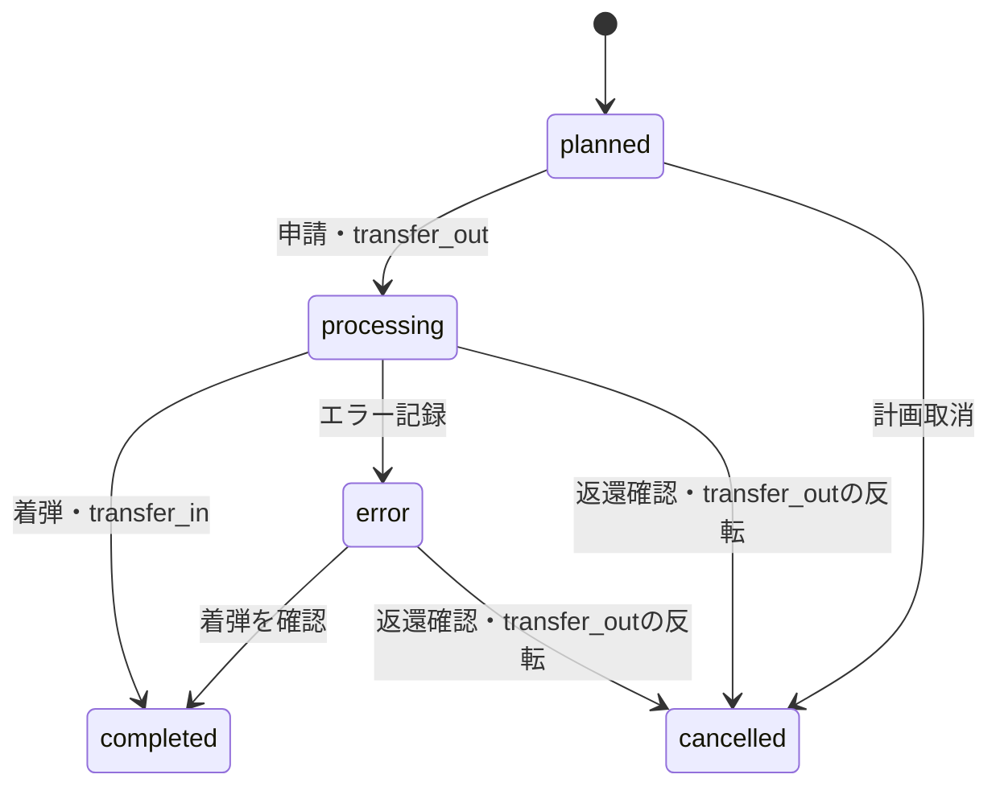

# ポイント・マイル移行の状態と数量

`planned` では取引を作らない。申請時に移行元の利用可能残高をロックして確認し、期限付きロットは期限順に、残りはロットなし残高から `transfer_out / out` を記録する。着弾時に実際の受取数量を `transfer_in / in` として移行先口座へ記録する。どちらもステップの状態変更と同じ DB トランザクションで処理する。返還による取消はすべての `transfer_out` を反転する。`error` にするだけでは残高を戻さない。

`source_quantity` は移行元制度のネイティブ数量、`expected_destination_quantity` と `actual_destination_quantity` は移行先制度のネイティブ数量。`planning_equivalent_quantity` は別の制度で見た計画換算値で、移行先残高へ入れない。異なる制度の換算値を足し合わせない。ルール使用時は予定受取数量を作成時に計算して保存し、後でルールが変わっても過去のステップを再計算しない。

着弾予定日を過ぎた `processing` ステップだけを予定日超過として表示する。比較日は `Asia/Tokyo`。超過は保存状態ではない。中間口座の既存残高や合算移行を認めるため、前ステップの受取数量と次ステップの申請数量が一致する制約は置かない。
